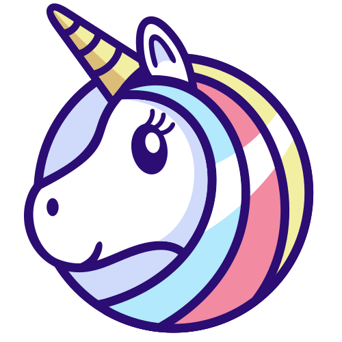
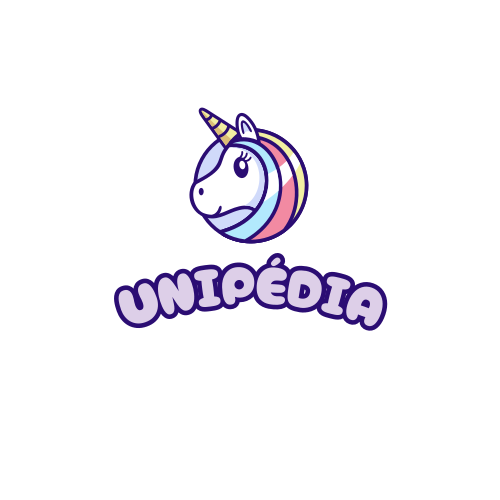

# Charte graphique

## LOGO

### 1 - Logo-texte

### 2 - Logo-longueur

### 3 - Logo-icone

### 4 - Logo-base

## COULEURS

- Violet : #AD88C6
- Violet clair : #DDCFE8
- Rose : #FFE6E6
- Bleu : #2B0D73
- Bleu clair : #AA9EC6

## GOOGLE FONT

- Logo : Cherry Bomb One

    - @import url('https://fonts.googleapis.com/css2?family=Cherry+Bomb+One&display=swap');
    - font-family: "Cherry Bomb One", system-ui;

- Titre : Handlee

  - `@import url('https://fonts.googleapis.com/css2?family=Handlee&display=swap');`

  - `font-family: "Handlee", cursive;`

- Texte : Patrick Hand SC

  - `@import url('https://fonts.googleapis.com/css2?family=Patrick+Hand+SC&display=swap');`

  -`font-family: "Patrick Hand SC", cursive;`

## BOX-SHADOW

  - `box-shadow: rgba(0, 0, 0, 0.24) 0px 3px 8px;`